# Voku Architecture Diagrams

> Visual documentation for v0.3 knowledge-first architecture.
> Last Updated: 2026-01-31

---

## 1. Graph Schema (Kuzu ER Diagram)


---

## 2. Goal-Anchored Knowledge Flow


---

## 3. Stated vs Revealed: Core Query Pattern

```mermaid
flowchart LR
    subgraph STATED["What You Say You Want"]
        s1["intention: want-software-engineer-job<br/>source_type: explicit"]
        s2["intention: prioritize-interview-prep<br/>source_type: explicit"]
    end
    
    subgraph REVEALED["What Behavior Shows"]
        r1["pattern: 40hrs-on-side-projects-0hrs-leetcode<br/>source_type: inferred"]
        r2["pattern: avoids-networking-tasks<br/>source_type: inferred"]
    end
    
    subgraph VOKU["Voku Surfaces"]
        gap["🔍 Gap Detected:<br/>Stated priority ≠ Time allocation"]
    end
    
    STATED --> gap
    REVEALED --> gap
```



---

## 3. System Architecture (Full Stack)

```mermaid
flowchart TB
    subgraph Frontend["Frontend (React + TypeScript)"]
        chat[Chat Interface]
        graph[Graph View]
        pages[Domain Pages]
    end
    
    subgraph Backend["Backend (FastAPI)"]
        routers[Routers]
        services[Services]
        extraction[LLM Extraction]
    end
    
    subgraph Storage["Storage Layer"]
        subgraph SQLite["voku.db (SQLite)"]
            nodes_table[(nodes)]
            edges_table[(edges)]
            templates_table[(templates)]
            transactions[(transactions)]
            merchants[(merchants)]
        end
        sessions_json[JSON Sessions]
        registry[Variable Registry]
    end
    
    subgraph LLM["LLM Providers"]
        groq[Groq API]
        ollama[Ollama Local]
    end
    
    chat --> routers
    graph --> routers
    pages --> routers
    
    routers --> services
    services --> extraction
    services --> SQLite
    services --> sessions_json
    services --> registry
    
    extraction --> groq
    extraction --> ollama
```

---

## 4. Data Flow: Conversation → Graph


---

## 5. Organization Layer Flow


---

## Quick Reference

| Diagram | Purpose | Interview Use |
|---------|---------|---------------|
| Graph Schema | Kuzu data model with goal-anchored fields | "Here's the technical implementation" |
| Goal-Anchored Flow | How intentions flow through the system | "This is what makes it personal, not a knowledge base" |
| Stated vs Revealed | Core value proposition | "Voku surfaces self-deception — where stated ≠ revealed" |
| System Architecture | Full stack overview | "Here's how it all connects" |
| Data Flow | Runtime behavior | "Here's what happens when you chat" |
| Organization Layer | Hidden cognitive workspace | "Voku reasons before proposing" |
