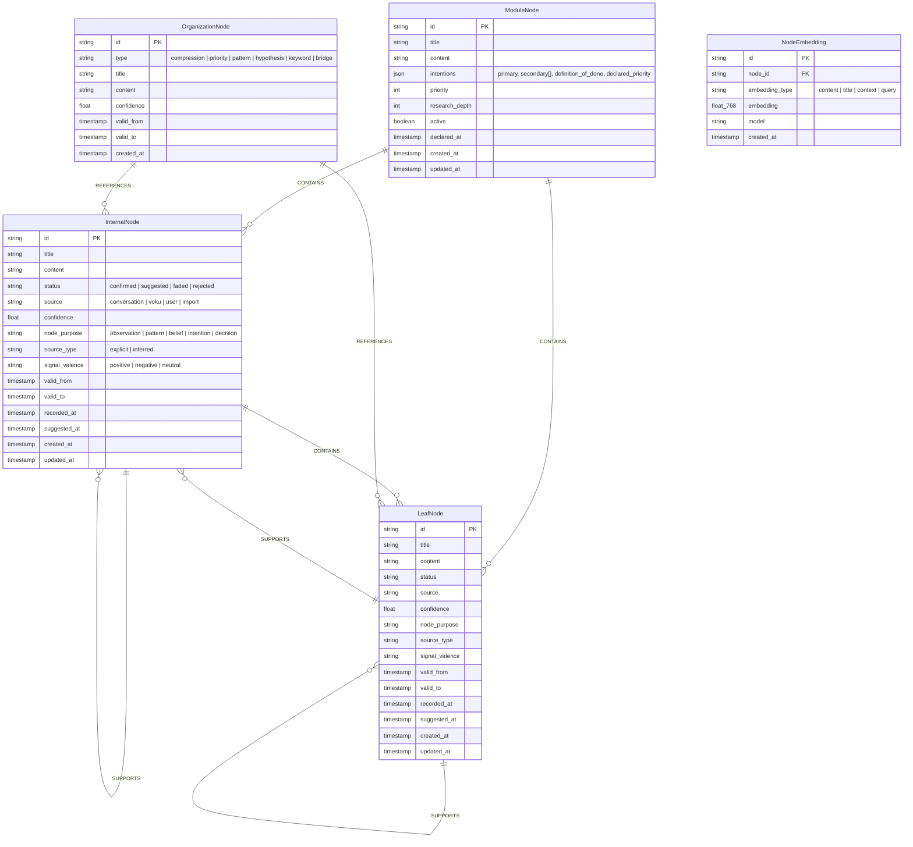
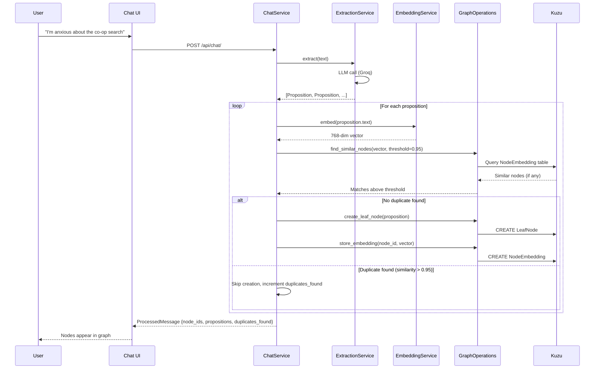
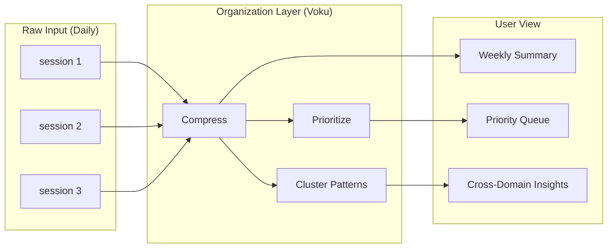

# Voku Architecture Diagrams

> Visual documentation for v0.3 knowledge-first architecture.
> Last Updated: 2026-02-07

---

## 1. Graph Schema (Kuzu ER Diagram)



---

## 2. Goal-Anchored Knowledge Flow

```mermaid
flowchart TB
    subgraph USER["User Space (What User Sees)"]
        subgraph MODULE["Modules (Goal Containers)"]
            fitness["fitness<br/>intention: Half marathon under 2 hours"]
            career["career<br/>intention: Software engineer role"]
        end

        subgraph INTERNAL["Internal Nodes (Abstractions)"]
            pattern1["pattern: I-underestimate-social-tasks<br/>source_type: inferred<br/>signal_valence: negative"]
            belief1["belief: networking-feels-inauthentic<br/>source_type: explicit"]
        end

        subgraph LEAF["Leaf Nodes (Extracted)"]
            obs1["observation: ran-5k-2430-jan28<br/>signal_valence: positive"]
            intent1["intention: want-sub-2hr-half-marathon<br/>source_type: explicit"]
            decision1["decision: chose-kuzu-over-sqlite"]
        end
    end

    subgraph ORG["Organization Space (Voku's Hidden Workspace)"]
        compress["Compression: weekly-summary"]
        hypo["Hypothesis: stated-vs-revealed-gap"]
        keyword["Keyword: vertical-pull → compound-movement"]
    end

    MODULE --> INTERNAL
    INTERNAL --> LEAF
    ORG -.->|proposes| INTERNAL
    ORG -.->|detects patterns| LEAF

    hypo -.->|surfaces| pattern1
```



---

## 3. Stated vs Revealed: Core Query Pattern

```mermaid
flowchart LR
    subgraph STATED["What You Say You Want"]
        s1["intention: want-software-engineer-job<br/>source_type: explicit"]
        s2["intention: prioritize-interview-prep<br/>source_type: explicit"]
    end

    subgraph REVEALED["What Behavior Shows"]
        r1["pattern: 40hrs-on-side-projects-0hrs-leetcode<br/>source_type: inferred"]
        r2["pattern: avoids-networking-tasks<br/>source_type: inferred"]
    end

    subgraph VOKU["Voku Surfaces"]
        gap["🔍 Gap Detected:<br/>Stated priority ≠ Time allocation"]
    end

    STATED --> gap
    REVEALED --> gap
```



---

## 4. System Architecture

```mermaid
flowchart TB
    subgraph Frontend["Frontend (React + TypeScript)"]
        chat[Chat Interface]
        graph[Graph Visualization]
    end

    subgraph Backend["Backend (FastAPI)"]
        router[Chat Router]
        chat_svc[ChatService]
        extract_svc[ExtractionService]
        embed_svc[EmbeddingService]
    end

    subgraph Graph["Graph Layer"]
        graph_ops[GraphOperations]
        kuzu[(Kuzu 0.11.3<br/>ModuleNode / InternalNode / LeafNode<br/>OrganizationNode / NodeEmbedding)]
    end

    subgraph LLM["LLM Providers"]
        groq[Groq API<br/>llama-3.3-70b]
        ollama[Ollama<br/>Local Models]
    end

    subgraph Embeddings["Embedding Model"]
        bge[bge-base-en-v1.5<br/>768-dim vectors]
    end

    chat --> router
    graph --> router
    router --> chat_svc
    chat_svc --> extract_svc
    chat_svc --> embed_svc
    chat_svc --> graph_ops
    extract_svc --> groq
    extract_svc --> ollama
    embed_svc --> bge
    graph_ops --> kuzu
```

---

## 5. Data Flow: Conversation → Graph



---

## 6. Organization Layer Flow (Planned)



---

## Quick Reference

| Diagram | Purpose | Interview Use |
|---------|---------|---------------|
| Graph Schema | Kuzu data model with embedding table | "Here's the data model — 4 node types, 6 edge types, vector storage" |
| Goal-Anchored Flow | How intentions flow through the system | "This is what makes it personal, not a knowledge base" |
| Stated vs Revealed | Core value proposition | "Voku surfaces where stated intentions ≠ observed patterns" |
| System Architecture | Full stack overview | "Here's how services compose — extraction, embedding, graph ops" |
| Data Flow | Runtime pipeline with dedup | "Here's the per-turn pipeline: extract → embed → dedup → store" |
| Organization Layer | Hidden cognitive workspace (planned) | "Phase 2: batch clustering proposes abstractions from leaves" |
